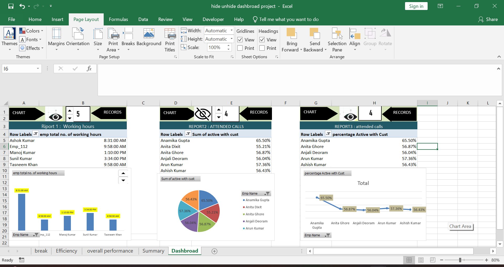

# Excel Dynamic Dashboard Controller 📊

An interactive, VBA-powered Excel Dashboard designed to manage complex data views by dynamically hiding and unhiding specific sheets based on user navigation.

---

## 📸 Dashboard Preview
Here is a quick look at the interactive dashboard interface:

---

## 🌟 Key Features
* **Dynamic Navigation:** Easily switch between different views/sheets using interactive buttons.
* **VBA/Macro Powered:** Clean VBA code (`.xlsm`) to automate the hide/unhide functionality smoothly.
* **Clean UI/UX:** Keeps the Excel workbook clutter-free by showing only the required sheets at a time.
* **Pivot Tables & Charts:** Integrated analytical reports with interactive visuals.

---

## 🛠️ How to Use
1. **Download** the `Interactive_Dashboard.xlsm` file from this repository.
2. Open it in Microsoft Excel.
3. Make sure to **Enable Macros/Content** when prompted by Excel (otherwise the hide/unhide buttons won't work).
4. Use the main menu/buttons to navigate and toggle sheets.
